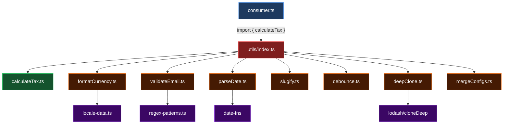

# This Is a Toll You Should Not Be Paying

<div v-click class="mt-8 text-xl text-gray-400">
One line. Every codebase. Zero suspicion.
</div>

<div class="abs-br m-6 flex gap-2 text-sm text-gray-500">
  <span>The Hidden Cost of Barrel Files</span>
</div>

<!--
Open with the code. Let it sit for a beat. Everyone in the room has written this line.
-->

---
layout: center
class: text-left
---

# <mdi-hand-back-right class="text-yellow-400 animate-pulse" /> Hands Up

<div class="mt-12 text-left">

```ts
// index.ts
export * from './some-util'
```

</div>

<div class="text-2xl mt-8 space-y-6">

<div v-click class="text-gray-300">How many of you have seen this pattern in your codebase?</div>

<div v-click class="text-gray-300">How many of you are using it today?</div>

<div v-click class="text-gray-300">How many of you think it's a clean, smart pattern?</div>

</div>

<!--
Pause between each question. Let hands go up. Build the false sense of safety.
-->

---
layout: center
class: text-center
---

<div class="text-4xl font-bold leading-relaxed">

What if I told you this <span v-mark.circle.red="1">innocent line</span>

can make part of your test suite run

<span v-click class="text-red-400 text-6xl font-black">up to 50% slower?</span>

</div>

<!--
This is the tension moment. Let it land. Don't rush past this.
-->

---
layout: section
---

# Why We Love Barrel Files

<div class="text-xl text-gray-400 mt-2">Before criticizing the pattern, let's respect it.</div>

---

# The Appeal of Barrel Files

<div class="grid grid-cols-2 gap-8 mt-8">

<div>

### Without barrel files

```ts
import { Button } from '../components/Button'
import { Input } from '../components/Input'
import { Modal } from '../components/Modal'
import { Tooltip } from '../components/Tooltip'
```

<div v-click class="mt-4 text-gray-400 text-sm flex items-center gap-2">
<mdi-emoticon-sad-outline class="text-lg" /> Long paths, repetitive, messy
</div>

</div>

<div v-click>

### With barrel files

```ts
import {
  Button,
  Input,
  Modal,
  Tooltip
} from '../components'
```

<div v-click class="mt-4 text-green-400 text-sm flex items-center gap-2">
<mdi-emoticon-happy-outline class="text-lg" /> Clean, elegant, organized
</div>

</div>

</div>

<!--
The audience needs to feel seen. If you jump too fast into "this is bad," people who use barrel files will resist you.
-->

---

# What Makes Barrel Files So Attractive

<v-clicks>

- <mdi-sparkles class="text-yellow-400" /> **Elegant imports** — shorter, cleaner import statements
- <mdi-folder-outline class="text-blue-400" /> **Encapsulation** — creates a public API surface for modules
- <mdi-navigation-outline class="text-green-400" /> **Reduces path noise** — no more `../../../deeply/nested/thing`
- <mdi-account-group class="text-purple-400" /> **Industry standard** — seen in open source and production code everywhere
- <mdi-check-circle class="text-teal-400" /> **Feels professional** — the kind of pattern senior devs use

</v-clicks>

<div v-click class="mt-8 p-4 rounded-lg bg-blue-500/10 border border-blue-500/20">
<mdi-information class="text-blue-400" /> This is not a fringe pattern. It is mainstream, recommended, and everywhere.
</div>

<!--
Spend a moment on each point. The audience should be nodding along.
-->

---
layout: quote
---

# "When I was new to programming in the army, I saw this pattern everywhere. It looked reasonable. It looked professional. So I adopted it without really questioning it."

<!--
This is the personal, human moment. It makes you relatable. Pause after this.
-->

---
layout: section
---

# The Warning I Ignored

<div class="text-xl text-gray-400 mt-2">Smart engineers kept saying "don't do this." I didn't listen.</div>

---
layout: center
---

<div class="text-2xl leading-relaxed max-w-2xl mx-auto">

<div v-click>I kept seeing very smart engineers say: <span v-mark.underline.red="1">don't use barrel files.</span></div>

<div v-click class="mt-6">But honestly? <span class="text-gray-400">It didn't bother me much.</span></div>

<div v-click class="mt-6">I hadn't been <span v-mark.highlight.orange="3">hurt by it</span> yet.</div>

<div v-click class="mt-6">It felt like one of those opinions people repeat <br/> <span class="text-gray-500">without showing the actual cost.</span></div>

</div>

<!--
This sets up the turning point: you were skeptical until reality forced you to care.
-->

---
layout: section
---

# Then It Became Real

<div class="text-xl text-gray-400 mt-2">The problem found me.</div>

---

# The Context: Matia

<div class="mt-6 space-y-4">

<v-clicks>

<div class="flex items-center gap-4 p-3 rounded-lg bg-white/5">
<mdi-language-typescript class="text-blue-400 text-3xl flex-shrink-0" />
<div><strong>Large TypeScript codebase</strong> — multiple internal packages and libraries</div>
</div>

<div class="flex items-center gap-4 p-3 rounded-lg bg-white/5">
<mdi-test-tube class="text-green-400 text-3xl flex-shrink-0" />
<div><strong>Test-heavy workflow</strong> — CI speed and feedback loops matter</div>
</div>

<div class="flex items-center gap-4 p-3 rounded-lg bg-white/5">
<mdi-speedometer class="text-orange-400 text-3xl flex-shrink-0" />
<div><strong>Developer experience is critical</strong> — slow tools = slow teams</div>
</div>

</v-clicks>

</div>

<div v-click class="mt-8 p-4 rounded-lg bg-gradient-to-r from-teal-500/10 to-blue-500/10 border border-teal-500/20">
<div class="font-bold text-lg mb-1">My role: DevEx Engineer</div>
<div class="text-gray-400">Part of my job is reducing friction for developers. Faster feedback loops, faster tests, faster builds. When something slows engineers down <span v-mark.underline.teal="5">every single day</span>, I care.</div>
</div>

<!--
Give just enough context. Don't over-explain Matia. The audience needs to understand: big codebase, tests matter, your job is to make things fast.
-->

---
layout: section
---

# The Investigation

<div class="text-xl text-gray-400 mt-2">Why does this elegant pattern create extra work?</div>

---

# What Developers Think Happens

<div class="mt-8">

```ts
import { calculateTax } from './utils'
```

</div>

<div v-click class="mt-6">


</div>

<div v-click class="mt-6 text-xl text-center text-gray-400">
"I import one thing, so only that thing should matter."
</div>

<div v-click class="mt-4 text-center text-green-400 text-lg">
<mdi-check class="mr-1" /> 1 file imported → 1 file resolved → fast
</div>

<!--
This is what developers assume. Simple, clean, minimal.
-->

---

# What Actually Happens

<div class="mt-4">

```ts
import { calculateTax } from './utils'
```

</div>

<div v-click class="mt-4 text-sm">

Where `./utils/index.ts` contains:

```ts {all|1-8|all}
export { calculateTax } from './calculateTax'
export { formatCurrency } from './formatCurrency'
export { validateEmail } from './validateEmail'
export { parseDate } from './parseDate'
export { slugify } from './slugify'
export { debounce } from './debounce'
export { deepClone } from './deepClone'
export { mergeConfigs } from './mergeConfigs'
```

</div>

<div v-click class="mt-4 text-red-400 text-center text-lg font-bold">
<mdi-alert class="mr-1" /> You asked for 1 thing. The tool has to consider all 8.
</div>

<!--
This is the key insight. The barrel re-exports EVERYTHING. Tools have to resolve the full graph.
-->

---

# The Dependency Graph Explosion

<div class="mt-2">



</div>

<div v-click class="text-center mt-2">
<span class="text-green-400">You wanted 1 module.</span> <span class="text-red-400">The barrel pulled in 8+ modules and their transitive dependencies.</span>
</div>

<!--
The visual really drives home the difference. One import, massive graph resolution.
-->

---

# Why Tests and Builds Pay the Price

<div class="grid grid-cols-2 gap-6 mt-6">

<div>
<v-clicks>

<div class="p-3 rounded-lg bg-red-500/10 border border-red-500/20 mb-3">
<div class="font-bold text-red-400"><mdi-file-tree class="mr-1" /> Wider dependency graph</div>
<div class="text-sm text-gray-400 mt-1">More files resolved, parsed, and loaded on every test run</div>
</div>

<div class="p-3 rounded-lg bg-orange-500/10 border border-orange-500/20 mb-3">
<div class="font-bold text-orange-400"><mdi-loading class="mr-1 animate-spin" /> Extra module resolution</div>
<div class="text-sm text-gray-400 mt-1">Test runners and bundlers do unnecessary work</div>
</div>

<div class="p-3 rounded-lg bg-yellow-500/10 border border-yellow-500/20 mb-3">
<div class="font-bold text-yellow-400"><mdi-sync-alert class="mr-1" /> Circular dependencies</div>
<div class="text-sm text-gray-400 mt-1">Barrel chains make cycles easy to create and hard to detect</div>
</div>

</v-clicks>
</div>

<div>
<v-clicks>

<div class="p-3 rounded-lg bg-purple-500/10 border border-purple-500/20 mb-3">
<div class="font-bold text-purple-400"><mdi-puzzle class="mr-1" /> Mocking complexity</div>
<div class="text-sm text-gray-400 mt-1">Tests mock more than they need to, brittle and slow</div>
</div>

<div class="p-3 rounded-lg bg-blue-500/10 border border-blue-500/20 mb-3">
<div class="font-bold text-blue-400"><mdi-timer-sand class="mr-1" /> Slower startup</div>
<div class="text-sm text-gray-400 mt-1">Every test file pays the initialization tax</div>
</div>

<div class="p-3 rounded-lg bg-teal-500/10 border border-teal-500/20 mb-3">
<div class="font-bold text-teal-400"><mdi-server class="mr-1" /> CI accumulation</div>
<div class="text-sm text-gray-400 mt-1">Hundreds of test files × unnecessary overhead = real time</div>
</div>

</v-clicks>
</div>

</div>

<!--
Each of these is a multiplier. In a large codebase they compound.
-->

---
layout: center
class: text-center
---

<div class="text-3xl mb-8 text-gray-400">Think of it this way:</div>

<div class="text-2xl leading-relaxed max-w-2xl mx-auto">

<div v-click>Every test that imports from a barrel file</div>

<div v-click class="mt-4 text-xl text-gray-500">pays the cost of resolving <span class="text-red-400 font-bold">everything</span> that barrel re-exports</div>

<div v-click class="mt-4 text-xl text-gray-500">even though it only <span class="text-green-400 font-bold">needs one thing</span></div>

<div v-click class="mt-8 text-4xl font-bold text-orange-400">
Multiply that by hundreds of test files.
</div>

</div>

<!--
This is the "aha" moment for many people. The cost per file is small. The cost at scale is huge.
-->

---
layout: section
---

# What I Actually Did

<div class="text-xl text-gray-400 mt-2">From hypothesis to proof.</div>

---

# The Migration Workflow

<div class="mt-6">

<v-clicks>

<div class="flex items-start gap-4 mb-4">
<div class="bg-blue-500 text-white rounded-full w-8 h-8 flex items-center justify-center font-bold flex-shrink-0 mt-1">1</div>
<div>
<div class="font-bold text-lg">Adopted <code>no-barrel-file</code> lint rule</div>
<div class="text-gray-400">Established the boundary — flag barrel imports in internal app code</div>
</div>
</div>

<div class="flex items-start gap-4 mb-4">
<div class="bg-blue-500 text-white rounded-full w-8 h-8 flex items-center justify-center font-bold flex-shrink-0 mt-1">2</div>
<div>
<div class="font-bold text-lg">Filled gaps for the specific codebase</div>
<div class="text-gray-400">Custom rules to handle edge cases in the Matia monorepo</div>
</div>
</div>

<div class="flex items-start gap-4 mb-4">
<div class="bg-blue-500 text-white rounded-full w-8 h-8 flex items-center justify-center font-bold flex-shrink-0 mt-1">3</div>
<div>
<div class="font-bold text-lg">Used AI assistance to fix imports and test mocks</div>
<div class="text-gray-400">Automated the tedious part — rewriting hundreds of import paths</div>
</div>
</div>

<div class="flex items-start gap-4 mb-4">
<div class="bg-blue-500 text-white rounded-full w-8 h-8 flex items-center justify-center font-bold flex-shrink-0 mt-1">4</div>
<div>
<div class="font-bold text-lg">Migrated enough code to test the hypothesis</div>
<div class="text-gray-400">Scoped the change — not the entire codebase, enough to measure</div>
</div>
</div>

<div class="flex items-start gap-4 mb-4">
<div class="bg-green-500 text-white rounded-full w-8 h-8 flex items-center justify-center font-bold flex-shrink-0 mt-1">5</div>
<div>
<div class="font-bold text-lg">Benchmarked before and after</div>
<div class="text-gray-400">Let the numbers speak — no opinions, just data</div>
</div>
</div>

</v-clicks>

</div>

<div v-click class="mt-2 p-3 rounded-lg bg-teal-500/10 border border-teal-500/20 text-sm">
<mdi-lightbulb class="text-teal-400" /> "I didn't want this to stay at the level of opinion, so I tried removing barrel-file imports and tested the effect."
</div>

<!--
This is a strong section because it turns the talk from theory into workflow. People want actionable steps.
-->

---

# The Transformation

````md magic-move
```ts
// Before: barrel imports everywhere
import { calculateTax, formatCurrency } from './utils'
import { UserService, AuthService } from './services'
import { Button, Modal, Input } from './components'
import { validateEmail, validatePhone } from './validators'
```

```ts
// After: direct imports to exact modules
import { calculateTax } from './utils/calculateTax'
import { formatCurrency } from './utils/formatCurrency'
import { UserService } from './services/UserService'
import { AuthService } from './services/AuthService'
import { Button } from './components/Button'
import { Modal } from './components/Modal'
import { Input } from './components/Input'
import { validateEmail } from './validators/validateEmail'
import { validatePhone } from './validators/validatePhone'
```
````

<div v-click class="mt-6 text-center text-gray-400">
More lines? Yes. &nbsp; <span v-mark.underline.green="2">But each import resolves only what it needs.</span>
</div>

<!--
The magic move animation makes this transformation really visual. More verbose, but dramatically more efficient for tooling.
-->

---
layout: center
class: text-center
---

# <mdi-chart-line class="text-green-400" /> The Results

<div class="text-xl text-gray-400 mt-4">Now for the part that made me take this seriously.</div>

---
layout: fact
---

# Up to 50%
## reduction in unit test runtime

<div class="text-lg text-gray-400 mt-4">
for the migrated portion of the test suite
</div>

<div v-click class="mt-8 text-sm text-gray-500 max-w-lg mx-auto">
In an internal proof of concept, removing barrel-based imports reduced runtime for part of our unit test suite by up to 50%, with even bigger improvements on some machines.
</div>

<!--
Let this number sit. This is the payoff moment. Be precise about scoping: "part of the suite," "internal proof of concept," "varied by machine."
-->

---

# The Benchmark Breakdown

<div class="mt-6">

<div class="grid grid-cols-2 gap-8">

<div>
<div class="text-sm text-gray-400 uppercase tracking-wider mb-3">Before</div>
<div class="bg-red-500/10 border border-red-500/30 rounded-xl p-6">
<div class="text-5xl font-black text-red-400">~60s</div>
<div class="text-gray-400 mt-2">Test suite runtime</div>
<div class="mt-4 space-y-2 text-sm text-gray-500">
<div class="flex items-center gap-2"><mdi-file-tree class="text-red-400" /> Deep barrel chains</div>
<div class="flex items-center gap-2"><mdi-sync-alert class="text-red-400" /> Transitive imports loaded</div>
<div class="flex items-center gap-2"><mdi-timer-sand class="text-red-400" /> Unnecessary module init</div>
</div>
</div>
</div>

<div v-click>
<div class="text-sm text-gray-400 uppercase tracking-wider mb-3">After</div>
<div class="bg-green-500/10 border border-green-500/30 rounded-xl p-6">
<div class="text-5xl font-black text-green-400">~30s</div>
<div class="text-gray-400 mt-2">Test suite runtime</div>
<div class="mt-4 space-y-2 text-sm text-gray-500">
<div class="flex items-center gap-2"><mdi-ray-start-arrow class="text-green-400" /> Direct imports only</div>
<div class="flex items-center gap-2"><mdi-check-circle class="text-green-400" /> Minimal dependency graph</div>
<div class="flex items-center gap-2"><mdi-lightning-bolt class="text-green-400" /> Faster module resolution</div>
</div>
</div>
</div>

</div>

</div>

<div v-click class="mt-6 text-center">
<div class="inline-flex items-center gap-2 bg-green-500/10 text-green-400 rounded-full px-6 py-2 text-lg font-bold">
<mdi-arrow-down class="text-xl" /> 50% faster
</div>
</div>

<!--
Side by side comparison. Let the visual do the talking. Note that results varied by machine and test area — be transparent about that.
-->

---
layout: section
---

# What Should Teams Do?

<div class="text-xl text-gray-400 mt-2">The "I can do this on Monday" section.</div>

---
layout: two-cols-header
---

# Detect → Fix → Prevent

::left::

### <mdi-magnify class="text-blue-400" /> 1. Detect it

<v-clicks>

- Look for barrel imports in **hot paths**
- Inspect **test-heavy** areas first
- Watch for broad `index.ts` re-exports
- Check for **import cycles**
- Profile test startup time

</v-clicks>

::right::

### <mdi-wrench class="text-orange-400" /> 2. Fix it

<v-clicks>

- Replace barrel imports with **direct imports**
- Migrate **gradually** — not all at once
- Start with the **slowest test suites**
- Use AI tools to automate rewrites
- Verify with benchmarks after each change

</v-clicks>

<!--
Make this feel concrete and actionable. People should be thinking about their own codebase.
-->

---

# 3. Prevent Regressions

<div class="mt-8 space-y-4">

<div v-click class="p-4 rounded-xl bg-white/5 border border-white/10">

**ESLint: `no-barrel-file` / `no-barrel-import`**

```json
{
  "rules": {
    "import/no-barrel-import": "error"
  }
}
```

<div class="text-sm text-gray-400 mt-2">Prevents new barrel imports from being introduced in app code</div>
</div>

<div v-click class="p-4 rounded-xl bg-white/5 border border-white/10">

**ESLint: `import/no-cycle`**

```json
{
  "rules": {
    "import/no-cycle": "error"
  }
}
```

<div class="text-sm text-gray-400 mt-2">Catches circular dependencies that barrels make easy to create</div>
</div>

<div v-click class="p-4 rounded-xl bg-white/5 border border-white/10">

**Clear team convention**

<div class="text-sm text-gray-400 mt-2">Barrel files are for <span class="text-green-400">public package interfaces</span>, not for <span class="text-red-400">internal application code</span></div>
</div>

</div>

<!--
Linting rules are the long-term solution. Without them, barrel imports will creep back in.
-->

---
layout: center
---

# When Barrel Files Are Still Fine

<div class="mt-8 grid grid-cols-2 gap-8 max-w-3xl mx-auto">

<div v-click class="p-6 rounded-xl bg-green-500/10 border border-green-500/30">
<div class="text-2xl mb-3"><mdi-check-circle class="text-green-400" /></div>
<div class="font-bold text-lg text-green-400 mb-2">Good Use</div>
<div class="text-gray-300">Public interfaces for <strong>packages</strong> and <strong>libraries</strong></div>
<div class="mt-3 text-sm text-gray-500">When you intentionally control the API surface for external consumers</div>
</div>

<div v-click class="p-6 rounded-xl bg-red-500/10 border border-red-500/30">
<div class="text-2xl mb-3"><mdi-alert-circle class="text-red-400" /></div>
<div class="font-bold text-lg text-red-400 mb-2">Risky Use</div>
<div class="text-gray-300">Internal <strong>application code</strong>, especially test-heavy areas</div>
<div class="mt-3 text-sm text-gray-500">Where the convenience hides a growing performance cost from tooling</div>
</div>

</div>

<div v-click class="mt-10 text-xl text-center text-gray-400">
The conclusion is not "never use barrel files." <br/> It is: <span v-mark.underline.teal="3"><strong class="text-white">don't use them blindly.</strong></span>
</div>

<!--
This nuance is important. You don't want to sound dogmatic. Barrel files have legitimate uses.
-->

---
layout: center
class: text-center
---

# Takeaways

<div class="mt-8 space-y-6 text-left max-w-2xl mx-auto">

<div v-click class="flex items-start gap-4">
<div class="bg-blue-500 text-white rounded-full w-8 h-8 flex items-center justify-center font-bold flex-shrink-0 mt-1">1</div>
<div class="text-xl"><strong>Understand why</strong> barrel files can slow down builds and tests in large TypeScript codebases</div>
</div>

<div v-click class="flex items-start gap-4">
<div class="bg-orange-500 text-white rounded-full w-8 h-8 flex items-center justify-center font-bold flex-shrink-0 mt-1">2</div>
<div class="text-xl"><strong>Learn how</strong> to identify risky barrel imports and replace them with direct imports</div>
</div>

<div v-click class="flex items-start gap-4">
<div class="bg-green-500 text-white rounded-full w-8 h-8 flex items-center justify-center font-bold flex-shrink-0 mt-1">3</div>
<div class="text-xl"><strong>Prevent regressions</strong> with linting rules and clearer boundaries around where barrel files belong</div>
</div>

</div>

<!--
These are the three things the audience should leave with. Concrete, actionable, memorable.
-->

---
layout: quote
---

# "Barrel files improve the way code looks to humans, but they can worsen the way code behaves for tools."

---
layout: center
class: text-center
---

<div class="text-3xl font-bold leading-relaxed">

Cleaner imports are not free

if they make the dependency graph <span v-mark.circle.red="1">dirtier</span>.

</div>

<div v-click class="mt-12 text-lg text-gray-400">
Use barrel files <strong class="text-white">intentionally</strong>, not by default.
</div>

<div v-click class="mt-12 text-gray-500">
Thank you.
</div>

<!--
End on the memorable one-liner. Let it sit. Then open for questions.
-->

---
layout: end
---

# Thank You

<div class="text-gray-400 mt-4">Questions?</div>
